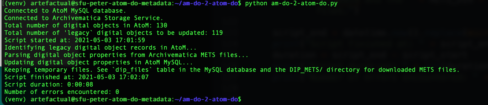

# am-do-2-atom-do
The purpose of this script is to update the metadata for all digital objects that were uploaded into AtoM from Archivematica before an AtoM 2.7 upgrade. This will enable the AtoM 2.7 enhanced digital object metadata and AIP/file download feature for all these "legacy" digital objects.

* [Background](#background)
* [Methodology](#methodology)
* [Instructions](#instructions)
* [Notes](#notes)

# Background
Prior to release 2.7, digital object metadata display in AtoM was confusing. It was not clear which file representation the information was referring to. This was particularly true if the digital object was uploaded from Archivematica and therefore may have had an original format and preservation copy in Archivematica as well as a "master", "reference" and "thumbnail" representation in AtoM.


This was the reason [enhanced digital object metadata display](https://www.accesstomemory.org/en/docs/2.7/user-manual/import-export/upload-digital-object/#digital-object-metadata) was introduced in AtoM 2.7.


The enhanced display includes more information about each digital object representation as well as the ability to download the AIP and the originally ingested file from Archivematica (if the user has permission and if the metadata to facilitate that request is present in AtoM in the first place). 


The enhanced digital object metadata and original file download feature will work for users of integrated Archivematica and AtoM installations from release 2.7 forward. However, this does not apply to all the digital objects they may have ingested into Archivematica and described in AtoM prior to the upgrade. That's the gap this script is intended to address.

# Methodology

1. Run a query to identify all "legacy" digital object records in the AtoM MySQL database.
2. Save these to a new AtoM MySQL working table along with the file's AIP and FILE UUID from Archivematica.
3. Information about digital objects loaded into AtoM via Archivematica is stored in the Properties table in AtoM. Rather than replace these one at a time and supplement them with missing data, this script simply flushes all property values for legacy digital objects and then adds all of the pre-existing and new property values in another pass.
4. Download the METS file corresponding to the digital object from the Archivematica Storage Service.
5. Parse the METS file for all the AtoM 2.7 digital object property values.
6. Update the AtoM MySQL working table with the parsed values.
7. Insert new AtoM MySQL property records for legacy digital objects using the full set of values from the working table.
8. Report on number of records updated.
9. Delete temporary METS download folder and MySQL working table.

# Instructions

1. Freeze data entry on your AtoM 2.6.x site. Create a database snapshot as backup:  
   `$ mysqldump -u atom-user -p --no-tablespaces --databases atom > 2.6.dump.sql`
2. Upgrade AtoM to release 2.7.x. Be sure to run the SQL migrations as part of the upgrade. Create a database snapshot as backup:  
   `$ mysqldump -u atom-user -p --no-tablespaces --databases atom > 2.7.dump.sql`
3. Install a copy of the `am-do-2-atom-do.py` script on a host that has access to the AtoM MySQL server. One way to do this is to checkout the script from this Github repository:  
   `$ git checkout https://github.com/artefactual-labs/am-do-2-atom-do.git`
4. Move to the directory that contains the script. Create a Python virtual environment. This script has been developed and tested on Python 3.8.  
    `$ cd am-do-2-do`   
    `$ virtualenv venv`    
    `$ source venv/bin/activate`   
5. Install the script requirements:  
    `(venv)$ pip install -r requirements.txt`  
6. The script uses local environment variables to store secret login credentials for the AtoM MySQL database and Archivematica Storage Service. Either create these environment variables locally or write these login values directly into the script (see ~lines 10-21):  
   ```
   ARCHIVEMATICA_SS_URL
   ARCHIVEMATICA_SS_USER
   ARCHIVEMATICA_SS_KEY
   ATOM_MYSQL_DATABASE
   ATOM_MYSQL_USER
   ATOM_MYSQL_PASSWORD
7. Run the script:  
    `(venv)$ python am-do-2-atom-do.py`
8.  A successful run includes all the following output:  
    
9. If the script encounters a fatal error it will report the reason and abort. 
10. If the script encounters a processing error, it will report the error, add it to the error count, and continue processing. The goal is to complete the upgrade of the entire dataset without letting one or two data anomolies block the entire process. Instead, the script supports many error handling scenarios and its messages should provide enough detail to follow-up on any individual processing errors. Of course, if there is a very high error count that might indicate a more fundamental problem that needs to be resolved in the code.
11. After the script is run, all the AtoM 2.7 digital objects will automatically have enhanced digital object metadata display enabled. There is no need to do a SQL migration or search index upgrade. However, for the Download File feature to work, the AtoM administrator must enable the StorageService plugin and configure its Archivematica Storage Service access priviliges in `Settings > Storage Service`.
12. Restore from backup in case of any unforeseen, catastrophic errors:  
   `$ mysql -u atom-user -p atom < 2.7.dump.sql`  
      

# Notes

All the fields for the AtoM `property` and `property_i18n` tables:


-------------
All the Properties used by a post-2.7 AtoM digital object. Note that the "value" field is in the linked 'property_i18n' table:

```
  scope: Archivematica AIP
  name: objectUUID
  value: 3f9f484e-cbb4-4347-ba63-2e9f32196432
  -----------------
  scope: Archivematica AIP
  name: aipUUID
  value: 229e5aa2-69c3-4727-9716-767dfdc097b7
  -----------------
  scope: Archivematica AIP
  name: relativePathWithinAip
  value: objects/799px-Euroleague-LE_Roma_vs_Toulouse_IC-27.bmp
  -----------------
  scope: Archivematica AIP
  name: aipName
  value: test-rocket-3
  -----------------
  scope: Archivematica AIP
  name: originalFileName
  value: 799px-Euroleague-LE Roma vs Toulouse IC-27.bmp
  -----------------
  scope: Archivematica AIP
  name: originalFileSize
  value: 1437654
  -----------------
  scope: Archivematica AIP
  name: originalFileIngestedAt
  value: 2021-04-22T19:03:46.572565+00:00
  -----------------
  scope: Archivematica AIP
  name: preservationCopyFileName
  value: 799px-Euroleague-LE_Roma_vs_Toulouse_IC-27-3c66b38a-9447-4cfd-9917-f62628e7cbf9.tif
  -----------------
  scope: Archivematica AIP
  name: preservationCopyFileSize
  value: 1436120
  -----------------
  scope: Archivematica AIP
  name: preservationCopyNormalizedAt
  value: 2021-04-22T19:04:15.600692+00:00
  -----------------
  scope: premisData
  name: formatName
  value: Windows Bitmap
  -----------------
  scope: premisData
  name: formatVersion
  value: 3.0
  -----------------
  scope: premisData
  name: formatRegistryName
  value: PRONOM
  -----------------
  scope: premisData
  name: formatRegistryKey
  value: fmt/116
  -----------------
  scope: premisData
  name: otherEvent
  value: a:3:{s:4:"type";s:9:"ingestion";s:8:"dateTime";s:20:"2021-04-22T12:03:46Z";s:22:"linkingAgentIdentifier";a:3:{i:0;a:2:{s:4:"type";s:19:"preservation system";s:5:"value";s:20:"Archivematica-1.12.1";}i:1;a:2:{s:4:"type";s:15:"repository code";s:5:"value";s:5:"12345";}i:2;a:2:{s:4:"type";s:21:"Archivematica user pk";s:5:"value";s:1:"1";}}}
  -----------------
  scope: premisData
  name: otherEvent
  value: a:4:{s:4:"type";s:26:"message digest calculation";s:8:"dateTime";s:20:"2021-04-22T12:03:46Z";s:17:"outcomeDetailNote";s:64:"b4961eac5fb7a1ffae4b63ac033a6a25827e7b839594f6e8e0b8e4fb01ebd7c4";s:22:"linkingAgentIdentifier";a:3:{i:0;a:2:{s:4:"type";s:19:"preservation system";s:5:"value";s:20:"Archivematica-1.12.1";}i:1;a:2:{s:4:"type";s:15:"repository code";s:5:"value";s:5:"12345";}i:2;a:2:{s:4:"type";s:21:"Archivematica user pk";s:5:"value";s:1:"1";}}}
  -----------------
  scope: premisData
  name: otherEvent
  value: a:4:{s:4:"type";s:11:"virus check";s:8:"dateTime";s:20:"2021-04-22T12:03:47Z";s:7:"outcome";s:4:"Pass";s:22:"linkingAgentIdentifier";a:3:{i:0;a:2:{s:4:"type";s:19:"preservation system";s:5:"value";s:20:"Archivematica-1.12.1";}i:1;a:2:{s:4:"type";s:15:"repository code";s:5:"value";s:5:"12345";}i:2;a:2:{s:4:"type";s:21:"Archivematica user pk";s:5:"value";s:1:"1";}}}
  -----------------
  scope: premisData
  name: otherEvent
  value: a:4:{s:4:"type";s:12:"name cleanup";s:8:"dateTime";s:20:"2021-04-22T12:03:48Z";s:17:"outcomeDetailNote";s:182:"Original name="%transferDirectory%objects/799px-Euroleague-LE Roma vs Toulouse IC-27.bmp"; cleaned up name="%transferDirectory%objects/799px-Euroleague-LE_Roma_vs_Toulouse_IC-27.bmp"";s:22:"linkingAgentIdentifier";a:3:{i:0;a:2:{s:4:"type";s:19:"preservation system";s:5:"value";s:20:"Archivematica-1.12.1";}i:1;a:2:{s:4:"type";s:15:"repository code";s:5:"value";s:5:"12345";}i:2;a:2:{s:4:"type";s:21:"Archivematica user pk";s:5:"value";s:1:"1";}}}
  -----------------
  scope: premisData
  name: formatIdentificationEvent
  value: a:5:{s:4:"type";s:21:"format identification";s:8:"dateTime";s:20:"2021-04-22T12:03:52Z";s:7:"outcome";s:8:"Positive";s:17:"outcomeDetailNote";s:7:"fmt/116";s:22:"linkingAgentIdentifier";a:3:{i:0;a:2:{s:4:"type";s:19:"preservation system";s:5:"value";s:20:"Archivematica-1.12.1";}i:1;a:2:{s:4:"type";s:15:"repository code";s:5:"value";s:5:"12345";}i:2;a:2:{s:4:"type";s:21:"Archivematica user pk";s:5:"value";s:1:"1";}}}
  -----------------
  scope: premisData
  name: otherEvent
  value: a:4:{s:4:"type";s:13:"normalization";s:8:"dateTime";s:20:"2021-04-22T12:04:15Z";s:17:"outcomeDetailNote";s:105:"%SIPDirectory%objects/799px-Euroleague-LE_Roma_vs_Toulouse_IC-27-3c66b38a-9447-4cfd-9917-f62628e7cbf9.tif";s:22:"linkingAgentIdentifier";a:3:{i:0;a:2:{s:4:"type";s:19:"preservation system";s:5:"value";s:20:"Archivematica-1.12.1";}i:1;a:2:{s:4:"type";s:15:"repository code";s:5:"value";s:5:"12345";}i:2;a:2:{s:4:"type";s:21:"Archivematica user pk";s:5:"value";s:1:"1";}}}
```
